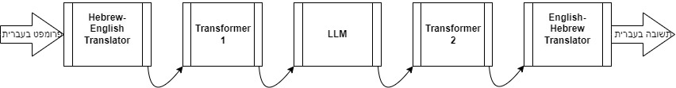

# Project Structure Overview

This document provides an overview of the project's structure, outlining the purpose of each directory and file. This should help in dividing the work effectively among developers.

## Directory and File Structure

```
/He_LLM/
│
├── facade_pipeline.py                # Orchestrates the overall processing pipeline
├── main.py                           # A basic example of how to use the pipeline
├── requirements.txt                  # Specifies project dependencies
│
├── /custom_transformers/             # Contains custom transformers for processing hidden states
│   ├── base_transformer.py           # Base class for transformers (inherits from nn.Module)
│   ├── transformer_1.py              # Implementation of the first custom transformer
│   └── transformer_2.py              # Implementation of the second custom transformer
│
├── /input_handler/                   # Manages user input and output
│   └── input_handler.py              # Handles input collection and output display
│
├── /llm/                             # Handles integration with the Language Model (LLM)
│   └── llm_integration.py            # Manages the processing of text and hidden states through the LLM
│
├── /tests/                           # Contains unit tests for the various components
│   ├── test_input_handler.py         # Unit tests for the input handler
│   ├── test_llm_integration.py       # Unit tests for LLM integration
│   ├── test_transformers.py          # Unit tests for custom transformers
│   └── test_translator.py            # Unit tests for translation logic
│
├── /evaluations/                     # Contains scripts for evaluating model performance
│   ├── next_word_prediction.py       # Script to evaluate next-word prediction accuracy
│   └── perplexity.py                 # Script to evaluate model perplexity
│
├── /translation/                     # Handles translation logic between Hebrew and English
│   └── helsinki_translator.py        # Implements translation using the Helsinki-NLP models
│
├── /models/                          # Stores saved model states
│   ├── transformer_1_Helsinki-NLP_opus-mt-tc-big-he-en_to_facebook_opt-125m.pth
│   ├── transformer_1_Helsinki-NLP_opus-mt-tc-big-he-en_to_facebook_opt-125m_state_dict.pth
│   ├── transformer_2_facebook_opt-125m_to_Helsinki-NLP_opus-mt-en-he.pth
│   └── transformer_2_facebook_opt-125m_to_Helsinki-NLP_opus-mt-en-he_state_dict.pth
│
├── /my_datasets/                     # Contains scripts and datasets used for model training
│   ├── create_datasets.py            # Script to create datasets for training
│   ├── english_sentences.csv         # Example dataset of English sentences
│   ├── hebrew_sentences.csv          # Example dataset of Hebrew sentences
│   ├── transformer1_dataset.pt       # Processed dataset for transformer 1
│   └── transformer2_dataset.pt       # Processed dataset for transformer 2
│
├── /utility/                         # Contains utility scripts
    └── injectable.py                 # 
```

## Detailed Directory and File Descriptions

### **1. `facade_pipeline.py`**
- **Purpose:** This file contains the `Pipeline` class, which orchestrates the entire processing flow. It coordinates the interaction between input handling, translation, transformers, and LLM integration.

### **2. `/custom_transformers/`**
- **Purpose:** This directory holds custom transformers that process hidden states between translation and LLM interaction.
  - **`base_transformer.py`**: Base class for transformers, handles model loading and training.
  - **`transformer_strategy.py`**: Defines the interface that all transformers must implement.
  - **`transformer_1.py` & `transformer_2.py`**: Specific implementations of transformers. Developers focusing on model transformation will work here.

### **3. `/llm/`**
- **Purpose:** Handles integration with the Language Model (LLM), such as OPT.
  - **`llm_integration.py`**: Manages the processing of text and hidden states through the LLM. Developers working on LLM-related logic will focus here.

### **4. `/input_handler/`**
- **Purpose:** This directory contains the logic for handling user input and output.
  - **`input_handler.py`**: Manages input collection and output display. Developers working on user interaction will focus here.

### **5. `/translation/`**
- **Purpose:** Contains modules related to translating Hebrew text to English and vice versa.
  - **`helsinki_translator.py`**: Implements translation using the Helsinki-NLP models. Developers focusing on translation logic will work here.

### **6. `/tests/`**
- **Purpose:** Contains unit tests to ensure the reliability of each component.
  - **Unit Tests:** Each file tests a specific module or component of the project. Developers working on quality assurance and testing will focus here.

## Assigning Work to Developers

- **User Interaction (Input/Output):** Work on `/input_handler/` directory.
- **Translation Logic:** Focus on `/translation/` directory.
- **Transformer Development:** Work on `/custom_transformers/` directory and `/training/` scripts.
- **LLM Integration:** Focus on `/llm/` directory.
- **Testing:** Focus on `/tests/` directory and ensure all modules are covered.
- **Evaluation and Performance Testing:** Use and potentially extend `next_word_prediction_test.py`.



## How to Run

### Using the Virtual Environment

Installation:

```bash
conda create -n myenv python=3.10
conda activate myenv
conda install pytorch torchvision torchaudio pytorch-cuda=12.6 -c pytorch -c nvidia
pip install torch torchvision torchaudio --index-url https://download.pytorch.org/whl/cu118
```


To activate the virtual environment and run the project, follow these ***example*** steps:

```bash
conda activate myenv
```

Once activated, you can execute your scripts or commands within this environment. When you're finished, deactivate the environment with:

```bash
deactivate
```